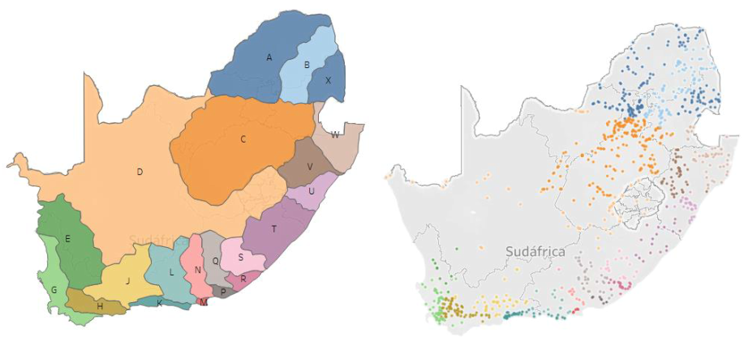

# Water quality in South Africa
### TFM: KSchool Data Science Master

## Overview

The aim of the project is the study of the quality of the water derived from inorganic chemistry. The data are collected  through the monitoring of the water in 1,045 stations of rivers, dams and lakes that are distributed in 21 drainage regions in South Africa.

The data are available in Excel spreadsheets and can be downloaded from the website of the Centre for Water Science and Management based at the North-West University (www.waterscience.co.za/waterchemistry/data.html). 

The project is divided into two parts:

- Analysis and characterization of South African surface waters.
- Prediction of water quality (Water Quality Index, Inorganic Chemistry Index and Sodium Adsorption Ratio) using Supervised Learning Regression Algorithms.

